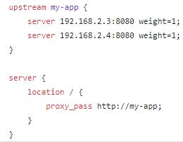
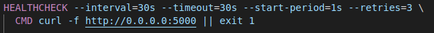
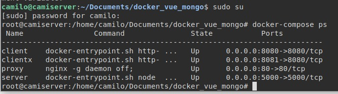

# SD2020A-final-project

#### Jose Camilo Moctezuma Ruiz - 
#### Julian Santiago Tauta Chaparro - A00022232
#### Cristian Duque - A00301448
#### Camilo Penagos - A00301416

### Objetivos

 * Diseñar la arquitectura de un sistema distribuido que implemente un conjunto de microservicios, considerando las implicaciones técnicas asociadas con su escalabilidad, tolerancia a fallos y concurrencia, y las mejoras en el desempeño a través de la asignación o reasignación de los recursos y tareas.
 * Desplegar un sistema distribuido, teniendo en cuenta las estrategias de administración de sus recursos consideradas en el diseño.
 * Gestionar el servicio distribuido, haciendo uso de herramientas de monitoreo y provisionamiento

## Arquitectura

La arquitectura propuesta para desarrollar el proyecto es la siguiente

<br/>

La arquitectura propuesta para dar solución al proyecto cuenta con una red docker de cuatro contenedores, que se comunica mediante REST con una base de datos en la nube para el almacenamiento. Esta red docker esta conformada por cuatro contenedores:

1. **Balanceador de carga:** Una instancia de Ngnix, que permite hacer el balanceo de carga a las peticiones de las instancias web. Este proxy esta expuesto para ser accedido por el puerto 80 

2. **Servidores Web:** Dos instancias de frontend desplegadas en Vue.js, estas instancias reciben peticiones http previamente balanceadas por el proxy Ngninx

3. **Servidor REST:** Servidor de backend desplegado en node.js que permite la comunicación REST con la base de datos en la nube


## Desarrollo

-  Este segmento corresponde a la implementación de cada componente:

### Base de datos:
Para este componente se usó una base de datos mongodb alojada en un servicio llamado mongoatlas.<br/>
Es necesario primero crear un cluster<br/>
<br/>
Dentro del cluster es necesario:<br/><br/>
    1. Definir un usuario para la base de datos<br/>
<br/>
    2. Definir la lista de ip que pueden acceder a la base de datos, en este caso es 0.0.0.0 para que se pueda acceder desde cualquier lugar
<br/>
Una vez hecho esto, volvemos a la ventana principal de cluster y hacemos click en el botón connect 
<br/>
Ahi se abre una ventana y seleccionamos la opcion "connect your application"
<br/>
Ahora, en donde dice driver seleccionamos nodejs y la version 3.0. Esto se debe a que vamos a acceder a la base de datos usando un api en nodejs. Al hacer esto nos aparecera un texto con la url para acceder a la base de datos desde nodejs.
<br/>


### API rest de acceso y modificación de base de datos:

El api se implementó en nodejs, el propósito de este es ser un punto de conexión para insertar y recuperar información de la base de datos. <br/>
Para implementar el api se definieron dos clases .js:<br/>

1.	index.js: la cual es la clase principal en donde se inicia la ejecución del api. <br/>
Primero se definen algunas librerías que se van a usar, express y cors para facilitar la creación del api, y body-parser para facilitar la conversión y traducción de archivos json. <br/>
<br/>
Luego se define la ruta principal del api api/names/<br/>
<br/>
Y finalmente se exponen los servicios por el puerto 5000 y en el host 0.0.0.0<br/>
<br/>
Código completo clase index.js<br/>
<br/>

2.	names.js: es la clase en donde se implementan los métodos del api que permiten la conexión con la base de datos (get, post, etc). <br/>
En esta clase también es necesario importar express, y se importa mongodb que es la librería para facilitar la comunicación entre la base de datos mongo y nodejs <br/>
<br/>
Para que se pueda conectar al cluster de mongoatlas definido anteriormente es necesario usar el url mencionado previamente en la implementación de la base de datos. <br/>
<br/>
Finalmente se define cual es el nombre de la base de datos a la que se va a consultar, en este caso “names_db” <br/>
<br/>
Ahora se pueden implementar los métodos: <br/>
* De consulta, el cual se define como un get en la ruta “/” indicando que podrá ser consumido en la ruta api/names/, dentro del método se obtienen todos los datos de la colección names y luego se devuelve una lista con todos estos nombres.<br/>
<br/>
* El método de agregar datos se define como un post ubicado en la ruta “/” indicando que podrá ser consumido en la ruta api/names/, el método obtiene la información que se va a insertar del parámetro body del request que recibe cuando es llamado, luego agrega estos datos en la base de datos.<br/>
<br/>
* El último método implementado es el método de eliminar un nombre, el cual es definido como un delete en la ruta “/” indicando que podrá ser consumido en la ruta api/names/, este obtiene el identificador del nombre que va a eliminar body del request que recibe cuando es llamado, luego elimina el dato con este identificador en la base de datos.<br/>
<br/>
Código completo clase names.js<br/>
<br/>

### Front end:

Para el front end se implementó una aplicación web en vuejs. La cual consume el api implementado anteriormente para obtener y agregar información a la base de datos.<br/>
El api se consume en el front en de la siguiente manera:<br/>
Primero se copia el url por el que se va a consumir el api<br/>
<br/>
Luego se implementan los métodos de consumo del api<br/>
<br/>

### Balanceador de carga:

El balanceador de carga para las instancias web de Frontend, fue implementado usando el servidor Ngnix que permite una fácil configuración para balancear solicitudes. Solo es necesario indicar las instancias que se quieren balancear con su respectiva IP y el puerto expuesto. En la imagen se indica como es la configuación del servicio Ngnix para la arquitectura propuesta.<br/>

<br/>

### Dockerización de componentes anteriores

Una vez implementados los componentes anteriores es necesario dockerizarlos para que estos puedan correr independientemente en un contenedor. Para esto es necesario definir Dockerfiles para cada uno de los componentes.<br/>

El Dockerfile para el servidor API es el siguiente<br/>
<br/>
En él se definen el entorno, los manejadores de paquetes necesarios para la ejecución del api como npm, el comando npm install que instala todas la librerías de node usadas por el API, también se define el comando que se ejecutará cuando el contenedor inicie, en  este caso se ejecutará el archivo index.js usando npm.<br/>

El Dockerfile para el cliente web es el siguiente<br/>
<br/>
En él se definen: el entorno, los manejadores de paquetes necesarios para la ejecución de la aplicación web como npm y vue, el comando npm install que instala todas la librerías de node y vue usadas por la aplicación web, el comando npm run build construye el cliente web para que este pueda ser despegado en un servidor web iniciado por npm, y finalmente se define el comando que se ejecutara cuando el contenedor inicie,  en este caso se ejecutara un servidor http en el contenedor.<br/>

El Dockerfile para el balanceador de carga es el siguiente<br/>
<br/>
En él se definen el entorno, los manejadores de paquetes necesarios para la ejecución balanceador de carga nginx.<br/>

### Orquestador de contenedores mediante docker-compose:

Para orquestar los contenedores se decidió usar docker-compose para este se definió el archivo docker-compose de la siguiente manera:<br/>
* Se define una red que será creada por Docker para facilitar la comunicación entre los contenedores:<br/>
<br/>
* Luego se definen los contenedores que se van a usar:<br/>
    * Se define el servidor api con el nombre server, ahí se indica como se llama la carpeta donde se encuentran los archivos del contenedor, se indica el puerto en el que quedaran expuestos los servicios y se define la ip del contenedor dentro de la red creada por Docker.<br/>
    <br/>
    * Se define la aplicación web con el nombre client, ahí se indica como se llama la carpeta donde se encuentran los archivos del contenedor, se indica el puerto en el que quedaran expuestos sus servicios y se define la ip del contenedor dentro de la red creada por Docker.<br/>
    <br/>
    * Se define una segunda instancia de la aplicación web con el nombre clientx, ahí se indica como se llama la carpeta donde se encuentran los archivos del contenedor, se indica el puerto en el que quedarán expuestos los servicios y se define la ip del contenedor dentro de la red creada por Docker.<br/>
    <br/>
    * Y finalmente se define el balanceador de carga con el nombre proxy, ahí se indica como se llama la carpeta donde se encuentran los archivos del contenedor, se indica el puerto en el que quedarán expuestos los servicios y se define la ip del contenedor dentro de la red creada por Docker.<br/>
    <br/>
Archivo docker-compose completo<br/>
<br/>

### Implementación del sistema de health check:
Esta instrucción es implementada en los contenedores para verificar que esté funcionando los servicios correctamente. En este caso, cada docker-file posee su propio healthcheck que permite identificar el estado del contenedor asociado. Cada contenedor con healthcheck puede tener algunos de los siguientes 3 estados: Starting (Etapa de revisión del estado del contenedor) ,Healthy (Etapa de paso exitoso de la revisión) y Unhealthy (Etapa de fallos consecutivos de llamados al contenedor). <br/><br/>

A continuación, veamos su implementación en el docker-file perteneciente al servidor web: <br/>
<br/>

En la primera línea observamos 4 parámetros que posee el healthcheck
1. interval: Define un espacio de tiempo para realizar la revisión.
2. timeout: Es el tiempo máximo para recibir una respuesta por parte del contenedor, sino se considera fallido.
3. start period: Es un tiempo de inicialización necesario para que el contenedor arranque.
4. retries: Es el número de fallos consecutivos del healthcheck en el contenedor para ser considerado unhealthy.<br/>

En la segunda línea se usa el comando curl para obtener una respuesta http por parte del servidor web para comprobar el estado del contenedor, si falla retorna el código de estado 1. <br/>
De la misma manera, se ha implementado los healthchecks a los contenedores de los clientes y el balanceador de carga<br/><br/>

Para verificar el estado, se usa el comando 'docker-compose ps'

<br/>
En la columna status vemos que los contenedores están corriendo. En el siguiente apartado se comprueba el estado health(starting) en cada uno de los contenedores con el comando 'docker ps'. 

### Pruebas de microservicios

para comenzar utilizamos mocha en conjunto con chai para realizar las pruebas de microservicios. Asi pues, en primer lugar definimos en el package.json que utilizaremos mocha para realizar las  pruebas de microservicios y agregamos las dependencias nescesarias para realizar las pruebas.
<br/>
Luego de esto procedemos a instalar tanto mocha como Chai y una dependencia llamada Chai-http
y procedemos con las pruebas de los microservicios. En la primera prueba tenemos una funcion que trae todos los usuarios de la base de datos mientras que en la segunda realiza un post con  el nombre especifico que se envia mediante el body del post.
<br/>
Finalmente probamos con el comando de “npm test” y observamos que las pruebas se realizan correctamente.
<br/>

## Ejecución y funcionamiento:

Lo primero que debe de hacer es construir los contenedores de la red docker, para esto previamente fue configurado el docker compose como orquestador, posteriormente para construir los contenedores del sistema hay que usar el comando <br/>
```
docker-compose build
```
Tras ejecutar el comando, verificamos que no hayan errores en  este proceso<br/>
<br/>

Una vez construido ejecutamos el sistema con el comando<br/>
```
docker-compose up
```

Se evidencia que los contenedores han sido ejecutados correctamente por el orquestador, y que los servicios se encuentran corriendo.<br/>
<br/>

Podemos comprobar que los contenedores estén corriendo y que sus estados están en health(starting) con el healthcheck implementado anteriormente, a través del comando
```
docker ps
```
<br/>

Ahora podemos ver como funciona la aplicación:<br/>
Para acceder ingresamos la direccion 192.168.2.10:80/ en el navegador, también se puede ingresar por localhost:80/ o por 0.0.0.0:80
Esta dirección IP corresponde al contenedor proxy Ngnix, que está expuesto al usuario para ser accedido por web.<br/>
<br/>

Se evidencia que el balanceador Ngnix funciona correctamente y efectivamente está balanceado las solicitudes http que son atendidas por el puerto 80, cada que se presenta una nueva solicitud al proxy, este la redirecciona a la instancia de frontend que le corresponda y alterna cada vez.

<br/>

Para agregar un nombre escibimos el nombre en el campo de texto y hacemos click en agregar<br/>
<br/>
<br/>

Una vez agregado exitosamente el nombre aparecerá en la lista<br/>
<br/>

También podemos comprobar que fue agregado en la base de datos<br/>
<br/>

## Problemas

En la implementación del healthcheck ocurre un inconveniente después de cierto tiempo en el que los contenedores están corriendo:<br/>

<br/>

Podemos ver que el estado de los contenedores es "unhealthy". Esto se debe a que está retornando un exit status de 1, y está considerando unhealthy a los contenedores; porque el comando curl no estaba funcionando de manera exitosa en los contenedores. 

Al momento de hacer la integracion continua con Jenkins nos genero un error debido a que utilizamos el puerto en el cual se podia acceder a jenkins. Sin embargo al momento de cambiar el puerto de acceso a la herramienta de jenkins no se podia acceder aun  cuando el programa  estaba iniciado. Lo que nos parece mas extraño es que ambos procesos (cliente de docker y jenkins) escuchaban en la misma direccion (localhost:8080) sin embargo en ningun momento salto algun mensaje de error ni se detuvo alguno de ellos por la negacion del acceso al puerto.</br>
</br>
